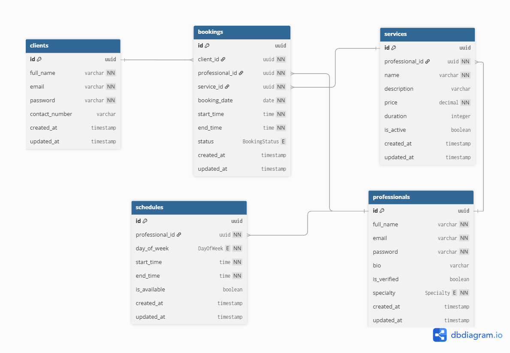

# bloom-backend
Backend for Bloom

## Architectural Decisions

### 1. Backend Framework: FastAPI

Booking system requires handling concurrent requests (multiple users checking availability/booking simultaneously). FastAPI's native async support efficiently handles I/O-bound database queries without thread overhead. Built-in request validation (Pydantic) and auto-generated API docs reduce boilerplate and improve developer experience.

### 2. ORM: SQLAlchemy with Async Support

SQLAlchemy is framework-agnostic and integrates seamlessly with FastAPI. Async driver (sqlalchemy[asyncio]) preserves FastAPI's concurrency advantages at the database layer, preventing blocking on queries.

### 3. Package Management: Poetry

Deterministic dependency locking (poetry.lock) ensures identical environments across dev, CI, and production. Separates direct dependencies from transitive. Automatic and foolproof compared to manual pip freeze.

### 4. Module Separation: Four Core Modules

* User Management
* Service Management
* Schedule Management
* Bookings Management 

Each handles distinct domain logic. Clear separation of concerns improves testability, maintainability, and team collaboration. Each module owns its routes, models, and business logic.

**NB:** Schedule Management and Bookings Management are tightly integrated. Bookings are validated against available slots to prevent double-booking.

## Database Schema

The schema follows multi-tenant architecture. Each professional's data is isolated by professional_id. Key design decisions:

1. **Auto-confirmation:** Bookings auto-confirm when within professional's available schedule. No manual approval step needed.
2. **Overlap prevention:** Bookings table stores start_time and end_time (calculated from service duration). Application logic prevents overlapping bookings. Database constraint enforces uniqueness per professional per time slot.
3. **Soft deletes:** Services and schedules use is_active/is_available flags. Historical data preserved for audits.




## Getting Started

### Prerequisites

- **Python** 3.11+
- **Poetry** (dependency manager)

### Quick Start

#### 1. Install Dependencies
```bash
poetry install
```

#### 2. Environment Setup

Create `.env`:
```
DATABASE_URL=sqlite:///./bloom.db
SECRET_KEY=your-secret-key-here
JWT_ALGORITHM=HS256
ACCESS_TOKEN_EXPIRE_MINUTES=30
REFRESH_TOKEN_EXPIRE_DAYS=7
```

Tables auto-create on first startup.

#### 3. Run Development Server
```bash
poetry run uvicorn main:app --reload
```

Server runs on `http://localhost:8000`

- Swagger UI: `http://localhost:8000/docs`
- ReDoc: `http://localhost:8000/redoc`


## Project Structure
```
bloom-backend/
├── users/              # Client & Professional auth
│   ├── models.py
│   ├── schemas.py
│   ├── services.py
│   ├── routes.py
│   └── tests.py
├── services/           # Beauty services
├── schedules/          # Professional availability
├── bookings/           # Client bookings
├── database.py         # SQLAlchemy setup
├── dependencies.py     # Auth & middleware
├── app.py              # FastAPI app
└── constants.py        # Enums, error codes
```


## Testing
```bash
poetry run pytest                      # Run all tests
poetry run pytest -v                   # Verbose
poetry run pytest users/tests.py        # Single module
```


## Important Notes

⚠️ **CORS enabled** for `http://localhost:3000` (frontend dev)

⚠️ **Tables auto-created** on startup via lifespan event

⚠️ **SQLite used** for development


## Stack

- **Framework:** FastAPI
- **ORM:** SQLAlchemy 2.0
- **Validation:** Pydantic
- **Auth:** JWT (python-jose)
- **Password:** Argon2
- **Database:** SQLite (dev)
- **Testing:** Pytest + Factory Boy
---

**Frontend must run** on `http://localhost:3000` for full application flow.
